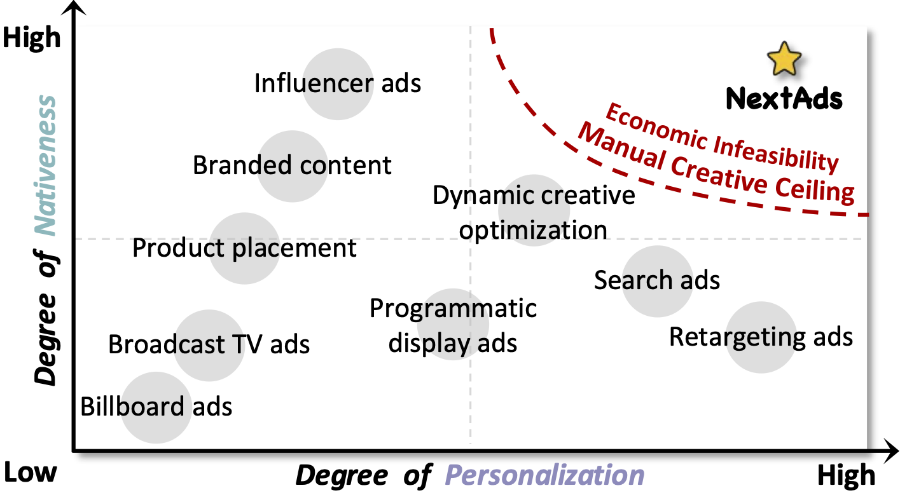
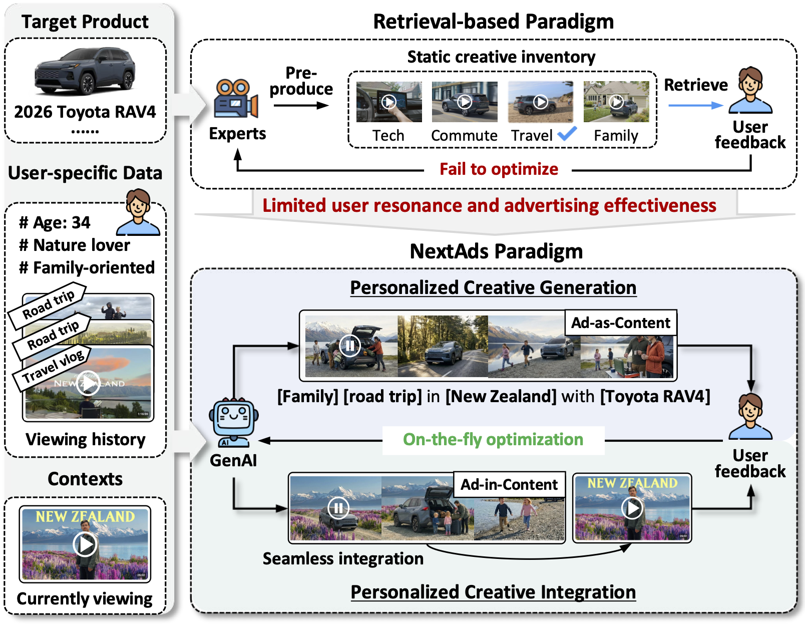

# NextAds: Towards Next-generation Personalized Video Advertising

<div align="center">
  <h3>
    👉 <a href="https://nextadsdemo.netlify.app" target="_blank">Click Here to Visit Our Project Page</a> 👈
  </h3>
  
  <a href="https://nextadsdemo.netlify.app" target="_blank">
    
  </a>
</div>


## Abstract

With the rapid growth of online video consumption, video advertising has become increasingly dominant in the digital advertising landscape. Yet diverse users and viewing contexts makes one-size-fits-all ad creatives insufficient for consistent effectiveness, underlining the importance of personalization. In practice, most personalized video advertising systems follow a retrieval-based paradigm, selecting the optimal one from a small set of professionally pre-produced creatives for each user. Such static and finite inventories limits both the granularity and the timeliness of personalization, and prevents the creatives from being continuously refined based on online user feedback. Recent advances in generative AI make it possible to move beyond retrieval toward optimizing video creatives in a continuous space at serving time.

In this light, we propose **NextAds**, a generation-based paradigm for next-generation personalized video advertising, and conceptualize NextAds with four core components. To enable comparable research progress, we formulate two representative tasks: **personalized creative generation** and **personalized creative integration**, and introduce corresponding lightweight benchmarks. To assess feasibility, we instantiate end-to-end pipelines for both tasks and conduct initial exploratory experiments, demonstrating that GenAI can generate and integrate personalized creatives with encouraging performance. Moreover, we discuss the key challenges and opportunities under this paradigm, aiming to provide actionable insights for both researchers and practitioners and to catalyze progress in personalized video advertising.

<p align="center">
  
</p>
<p align="center">
  <em><strong>Figure 1:</strong> The evolution of video advertising has largely progressed along the axes of personalization and nativeness, yet high production costs and manual creative bottlenecks prevent the industry from reaching the upper-right corner.</em>
</p>


## NextAds Framework 

<p align="center">
  
</p>
<p align="center">
  <em><strong>Figure 2: Paradigm shift: from retrieval to generation.</strong> NextAds transforms personalized video advertising from static retrieval over a discrete creative inventory to dynamic generation-based optimization in a continuous space.</em>
</p>
---

##  Two Representative Tasks

To enable comparable research progress and assess feasibility, this repository provides end-to-end pipeline instantiations for the two core tasks formulated in **NextAds**:
1. **Pipeline A (Personalized Creative Generation):** Generates personalized ads from scratch by blending user preferences with product characteristics.
2. **Pipeline B (Personalized Creative Integration):** Automatically inserts personalized soft ads into existing target video content.

---

## 🛠️ Global Environment Setup

1. Clone this repository:
   ```bash
   git repo clone RuoxuanXia/NextAds
   cd NextAds
   ```

2. Install dependencies:
   ```bash
   pip install -r requirements.txt
   ```

3. Set up Environment Variables. You will need API keys for the generation models (OpenAI, Sora-2), image hosting (Aliyun OSS), and evaluation models (Gemini):
   ```bash
   export OPENAI_API_KEY="sk-..."
   export OSS_ACCESS_KEY_ID="your_oss_key"
   export SORA2_API_KEY="your_sora_token"
   export GEMINI_API_KEY="your_gemini_api_key"
   ```

## Pipeline A: Personalized Creative Generation (PCG)

### Overview
This pipeline consists of the following five key stages:
* **Multimodal User Modeling**: We adopt a dual-stream approach to extract both textual and visual preferences from the user’s interaction history. First, for textual mining, **Director** analyzes click history to identify preference tiers and content style attributes (e.g., tone tags). Simultaneously, for visual extraction, we aggregate user-clicked images and employ a Vision LLM to decode structured visual metadata, capturing abstract “Vibe” descriptors and concrete reusable elements.
* **User-Product Matching**: Next, we employ a bidirectional scoring mechanism to align the extracted user profile with the product information. A VLM evaluates the compatibility between the user’s preference tiers and the product features, selecting the tier that maximizes *Product Match*, *Ad Nativeness*, and *Expressibility*. 
* **Storyboard Generation**: Based on the extracted visual metadata and textual preference, **Director** generates an executable, scene-level storyboard script, specifying camera motions, narration pacing, and visual composition for every 2–3 second slot.
* **Asset Grounding**: To support faithful generation, we implement a **Stitched Reference Strategy** that binds the creative plan to concrete visual assets. The system constructs a *User Visual Collage* from historical images and concatenates it with the official product images, enforcing both user style and product identity.
* **Video Creative Generation**: Finally, the **Producer** executes this plan by feeding the storyboard and the grounded assets into the video generation model to synthesize the final creative.

## 🚀 Quick Start
If you want to quickly test the generation pipeline with your own data without downloading the heavy benchmark datasets, use this pure folder-driven demo.

### 1. Prepare your data:
Simply modify the files in the```demo/history/```and```demo/product/ ```folders.

* ```demo/history/notes.json```: User's historical interaction texts.

* ```demo/history/.jpg```: User's preferred images (auto-collaged into a 2x2 grid).

* ```demo/product/info.json```: Target product descriptions.

* ```demo/product/product_image.jpg```: Official product image.

### 2. Run the demo:
   ```bash
cd Personalized Creative Generation/demo
python run_demo.py
   ```
Generated assets, including the storyboard script, the merged visual reference, and the final submitted API task, will be saved in ```demo/output/```.

## PCG-Bench
If you need to reproduce the paper's results or run large-scale concurrent evaluations on the benchmark datasets, proceed to the detailed instructions below.

### 1. Data Preparation (QILIN Dataset)
You can run our pipeline using either the full Parquet dataset or a pre-processed lightweight CSV subset.

**Option 1: Full Dataset (Parquet)**
Ensure you configure the dataset paths correctly in the global config section of `main.py`.
```text
qilin_dataset/
├── notes/                     # Parquet files containing note content
├── recommendation_train/      # User interaction history
├── user_feat/                 # User demographics (age, gender)
├── product_library/
│   ├── products.json          # Product metadata
│   └── images/                # Official product images
└── images/                    # Raw images linked in user notes
```

**Option 2: Pre-processed Subset (CSV)**
For quick testing, we provide `user_subset.csv`, which aggregates user demographics, clicked note texts, and linked image paths.
```csv
user_idx,gender,age,note_idx,note_title,note_content,image_paths
16,female,31-35,1739813,170mL Salon Haircut Comb Hair Dye Bottle Perm Lotion Bottle Bubble Dye Comb,"New arrival, 170mL salon haircut comb, hair dye bottle, perm lotion coloring bottle, bubble hair dye bottle",/path/to/images/3347833.jpg|/path/to/images/3347834.jpg
16,female,31-35,1545593,"Men's side hair grows fast, use a fade comb to cut at home","The most common problem for men is that the side hair grows very fast...",/path/to/images/2887858.jpg
16,female,31-35,896289,Dual-purpose haircut comb,#Haircut[Topic]# #KidsHaircut[Topic]# #GoodThingsRecommendation[Topic]#,
16,female,31-35,1121715,Haircut comb review,"With this comb, can you cut your own hair at home? #Review #Haircut #Comb #Unboxing",
16,female,31-35,886071,Sugar Orange and Gong's Little Orange,"#Phalaenopsis[Topic]# I prefer the color of Sugar Orange, a bright orange, but its growth is particularly poor...",/path/to/images/4535070.jpg|/path/to/images/4535071.jpg
```
*(Note: Multiple image paths are separated by a pipe `|` character. Empty image paths indicate text-only interactions.)*
**For your convenience, we have uploaded the pictures used in our benchmark on [PCG-Bench](https://1drv.ms/f/c/61ec5ad72cbbbe63/IgAfz7HW6NvDTbLlZIik_0gZAQKtszlO-2mCOoNxcaQDooY?e=o1OFqJ).**

### 💡 Utility Tool: Product Image Downloader & Stitcher
In real-world e-commerce scenarios, a product often comes with multiple image URLs (e.g., front view, side view, details). To facilitate testing, we provide a standalone utility script that automatically downloads these image URLs, resizes them to a uniform height, and stitches them horizontally into a single composite reference image for the generation pipeline.

**How to use:**
1. Place your raw product JSON containing `image_urls` at `product_library/products.json`.
2. Run the utility script:
   ```bash
   python download_and_stitch_products.py
3. The script will output the stitched images to product_library/images/ and generate a new product_library/products_output.json with the updated local paths, ready to be consumed by our Pipeline.
   
### 2. Usage
The main entry point is `main.py` (or `Personalized_Creative_Generation.py`). It supports end-to-end generation, batch submission, and asynchronous polling.

**End-to-End Generation:**
```bash
python main.py \
  --users "Userid1, Userid2" \
  --products "ProductA, ProductB" \
  --do_sora \
  --local_out "./output_samples"
```

**High-Concurrency Batch Generation:**
```bash
# Step A: Submit Only
python main.py --users "11094,15067" --products "ALL" --submit_only

# Step B: Poll and Download (Concurrent)
python main.py --users "11094,15067" --poll_only --sora_concurrency 4
```

### 3. Output Structure
Generated inside `ad_runs/user_{uid}/{product_name}/`:
* `storyboard.json`: LLM-generated shot-by-shot script.
* `sora_web_prompt.txt`: Final prompt sent to Sora-2.
* `sora_ref.jpg`: Merged reference image.
* `video.mp4`: Final generated 15s advertisement.
* `review.json`: Metadata linking all assets together.

---

## Pipeline B: Personalized Creative Integration (PCI)

### 1. Overview
The PCI Pipeline enables automatic personalized ad insertion. It generates user-preference-aligned soft ads by leveraging target video content, product information, and extracted user interaction history/personalization data.
The PCI Pipeline enables automatic personalized ad insertion through the following key stages:
* **Multimodal User Modeling**: Based on user interaction history (especially engaged videos), we use a VLM to preprocess and annotate preliminary attributes, including topic, textual presentation style, and visual presentation style (e.g., visual tone and camera motion). These are aggregated with video covers to construct a profile capturing the user’s textual, visual, and fine-grained element preferences.
* **Host Video Summarization**: We employ a VLM to generate a structured summary of the target host video, capturing four key aspects: topic, content, visual presentation, and audio characteristics.
* **Integration Decision**: Prioritizing integration smoothness, we bypass the user-product matching stage. Instead, a VLM determines the optimal integration point by identifying the frame in the host video that yields the most natural transition for introducing the product, outputting the chosen point, a brief rationale, and the exact start frame.
* **Storyboard Generation**: Utilizing the user profile, target product, host video summary, and integration decision, the VLM generates a detailed storyboard script. Crucially, the creative is constrained to start and eventually return to the selected integration point, ensuring a seamless visual loop back to the host context.
* **Asset Grounding**: To promote faithful generation and reduce hallucinations, we build a reference visual collage by compositing the target product images, user-preferred elements, and the selected integration start frame. This provides explicit visual grounding for the generation process.
* **Video Creative Integration**: Finally, a video generation model synthesizes the ad creative from the storyboard and grounded assets. The generated segment is then precisely inserted into the host video at the designated integration point.

## 🚀 Quick Start
If you want to quickly test the generation pipeline with your own data without downloading the heavy benchmark datasets, use this pure folder-driven demo.

### 1. Prepare your data:
Please prepare the following data:

* ```demo/all_covers```: A dictionary containing all covers of the videos; please name them 1.jpg, 2.jpg, ...

* ```demo/all_videos```: A dictionary containing all videos; please name them 1.mp4, 2.mp4, ...

* ```demo/products.json```: Contains all product information, including `product_name`, `product_url` (the URL to the product image), and `product_details` (the detailed introduction to the product).

* ```demo/users.json```: Contains, for each user, the interacted videos (vids; the last vid is the target video) and ad products.

### 2. Run the demo:
   ```bash
cd Personalized Creative Integration/demo
python run_demo.py
   ```

## PCl-Bench

### 1. Model Configuration
Configure the model settings in the `run.sh` script based on your preference:
* **Close-source Models (e.g., GPT-4o, Sora2):** Edit the `api_key` parameter.
* **Open-source Models (e.g., Qwen3-VL):** We recommend deploying LLMs using `vllm` or `sg-lang`. Edit the `base_url` parameter to point to your deployed model endpoint.

### 2. Data Preparation (MicroLens Dataset)
The anchor dataset for MicroLens is available in the official repository. Please refer to: [westlake-repl/MicroLens](https://github.com/westlake-repl/MicroLens/).

Key parameters:
* `vid`: Video ID in the MicroLens dataset.
* `uid`: User ID specified in `users.json`.

*Edit all necessary file paths (dataset path, output path) in `run.sh` to match your local environment before running.*

**For your convenience, we have uploaded the subset used in our benchmark on [PCl-Bench](https://1drv.ms/f/c/61ec5ad72cbbbe63/IgAfz7HW6NvDTbLlZIik_0gZAQKtszlO-2mCOoNxcaQDooY?e=o1OFqJ).**

### 3. Usage
Generate personalized integrated ads with a single command:
```bash
bash run.sh
```

---

## 📊 Evaluation Suite

We provide an automated evaluation pipeline to assess the quality of the generated personalized creatives across five dimensions. All dimensions are scored on a scale of **0-10**. 

*(Note: Metrics marked with  apply to both tasks, while   is specific to PCI.)*

| Dimension | Description | Script |
| :--- | :--- | :--- |
| **Diversity** <br>  | Evaluates variance in visual style and narrative across different products for the same user. | `eval_diversity.py` |
| **Presentation** <br>  | Measures how well the video's aesthetic, pacing, and tone align with the user's historical vibe. | `eval_main_metrics.py` |
| **Content** <br>   | Assesses if the ad highlights product features that resonate with specific user interests. | `eval_main_metrics.py` |
| **Identity Consistency**  | Verifies the factual accuracy of the product's appearance, logo, and selling points. | `eval_main_metrics.py` |
| **Integration** <br>  | Evaluates how naturally the advertisement is woven into the video content, considering contextual flow, thematic consistency, and user experience disruption. | `eval_main_metrics.py` |

### 1. How to Run

**A. Multi-Metric Evaluation (Main Results)**
Performs a three-way evaluation (Presentation, Content, Identity) by comparing videos against user historical notes and official product metadata.
```bash
python eval_main_metrics.py
```

**B. Diversity Evaluation**
Analyzes all videos generated for a single user to ensure the model avoids repetitive "template-like" content.
```bash
python eval_diversity.py
```

### 2. Output Structure
Evaluation results are saved in a structured CSV format, including both quantitative scores and qualitative reasoning:
```csv
user_id, product_name, presentation_score, presentation_reason, content_score, content_reason, ...
```


